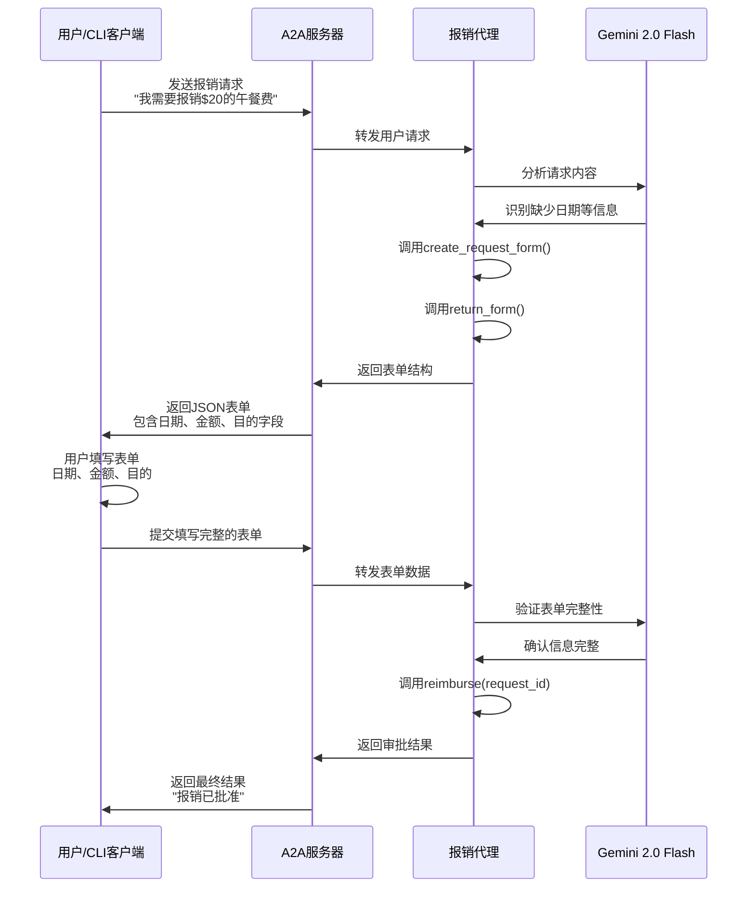

# ADK费用报销代理 (Expense Reimbursement Agent)

这是一个基于Google Agent Development Kit (ADK)开发的费用报销智能代理，作为[Agent2Agent](https://a2aprotocol.ai/) ([A2A](https://a2aprotocol.ai/))服务器运行。该代理的核心特性是**智能表单生成**：当用户的报销请求缺少必要信息时，代理会自动生成一个表单供用户填写，确保收集到完整的报销信息后再进行处理。

## 🎯 项目特色

- **智能表单交互**：自动检测缺失信息并生成动态表单
- **[A2A](https://a2aprotocol.ai/)协议支持**：标准化的代理间通信协议
- **流式处理**：支持实时响应和状态更新
- **Google ADK集成**：基于Google最新的代理开发工具包

## 📋 系统要求

- Python 3.12 或更高版本
- [UV](https://docs.astral.sh/uv/) 包管理工具
- Google API Key (Gemini模型访问权限)

## 🚀 快速开始

### 1. 获取Google API Key

1. 访问 [Google AI Studio](https://aistudio.google.com/)
2. 登录您的Google账户
3. 点击"Get API key"
4. 创建新的API key或使用现有的
5. 复制API key备用

### 2. 环境配置

```bash
# 克隆项目到本地（如果需要）
cd a2a-adk-expense-reimbursement

# 创建环境变量文件
echo "GOOGLE_API_KEY=your_api_key_here" > .env

# 替换your_api_key_here为您的实际API key
```

### 3. 安装依赖和运行

```bash
# 激活虚拟环境
source .venv/bin/activate

# 使用uv运行项目
uv run .
```

服务器将在 `http://localhost:10002` 启动。

### 4. 使用CLI客户端测试

打开新的终端窗口：

```bash
# 导航到CLI客户端目录（假设在samples/python/hosts/cli）
cd samples/python/hosts/cli

# 连接到报销代理
uv run . --agent http://localhost:10002
```

### 5. 测试交互示例

在CLI客户端中输入以下测试命令：

```
# 示例1：缺少信息的请求（会触发表单）
我需要报销$20的午餐费

# 示例2：完整信息的请求
我需要报销2024年1月15日的$50客户午餐费用

# 示例3：部分信息的请求
请帮我报销昨天的交通费$25
```

## 🏗️ 项目架构

### 核心文件结构

```
a2a-adk-expense-reimbursement/
├── __main__.py          # 服务器启动入口
├── agent.py             # 核心代理逻辑
├── agent_executor.py    # A2A请求执行器
├── pyproject.toml       # 项目配置和依赖
└── README.md           # 项目文档
```

### 主要组件说明

#### 1. `__main__.py` - 服务器入口
- 配置[A2A](https://a2aprotocol.ai/)服务器和代理信息
- 设置代理技能和能力描述
- 启动HTTP服务器监听请求

#### 2. `agent.py` - 核心代理逻辑
包含三个关键工具函数：

- **`create_request_form()`**: 创建报销表单模板
- **`return_form()`**: 将表单封装为[A2A](https://a2aprotocol.ai/)协议格式返回
- **`reimburse()`**: 执行实际的报销审批操作

#### 3. `agent_executor.py` - 请求执行器
- 处理[A2A](https://a2aprotocol.ai/)协议的请求和响应
- 管理任务状态（工作中、需要输入、已完成等）
- 协调代理与[A2A](https://a2aprotocol.ai/)服务器的通信

## 🔄 核心工作流程

以下时序图展示了报销代理的完整交互流程：



### 工作流程详解

1. **请求接收**：用户通过CLI客户端发送报销请求
2. **智能分析**：Gemini模型分析请求，识别缺失的必要信息
3. **表单生成**：如果信息不完整，自动生成包含所需字段的表单
4. **用户交互**：用户填写表单补充缺失信息
5. **信息验证**：验证表单数据的完整性和有效性
6. **报销处理**：执行报销审批并返回结果

## 🛠️ 高级配置

### 环境变量

```bash
# Google API配置
GOOGLE_API_KEY=your_api_key_here

# 使用Vertex AI（可选）
GOOGLE_GENAI_USE_VERTEXAI=TRUE

# 服务器配置
HOST=localhost
PORT=10002
```

### 自定义端口运行

```bash
uv run . --host 0.0.0.0 --port 8080
```

## 🧪 开发和调试

### 启用详细日志

代理默认启用INFO级别日志。查看详细的请求处理过程：

```bash
# 查看服务器日志
uv run . 2>&1 | tee agent.log
```

### 表单结构示例

代理生成的表单遵循JSON Schema格式：

```json
{
  "type": "form",
  "form": {
    "type": "object",
    "properties": {
      "date": {
        "type": "string",
        "format": "date",
        "title": "Date",
        "description": "Date of expense"
      },
      "amount": {
        "type": "string",
        "format": "number", 
        "title": "Amount",
        "description": "Amount of expense"
      },
      "purpose": {
        "type": "string",
        "title": "Purpose",
        "description": "Purpose of expense"
      }
    },
    "required": ["date", "amount", "purpose"]
  }
}
```

## ⚠️ 安全注意事项

**重要提醒**：本示例代码仅用于演示[Agent2Agent](https://a2aprotocol.ai/) ([A2A](https://a2aprotocol.ai/))协议的工作机制。在构建生产应用时，必须将任何外部代理视为潜在的不可信实体。

### 安全措施

- **输入验证**：对所有外部输入进行严格验证和消毒
- **数据处理**：谨慎处理代理卡片、消息、工件等数据
- **凭据管理**：实施适当的凭据保护措施
- **权限控制**：限制代理的访问权限和操作范围

## 🤝 贡献

欢迎提交Issues和Pull Requests来改进这个项目。

## 📄 许可证

请参考项目许可证文件了解使用条款。
